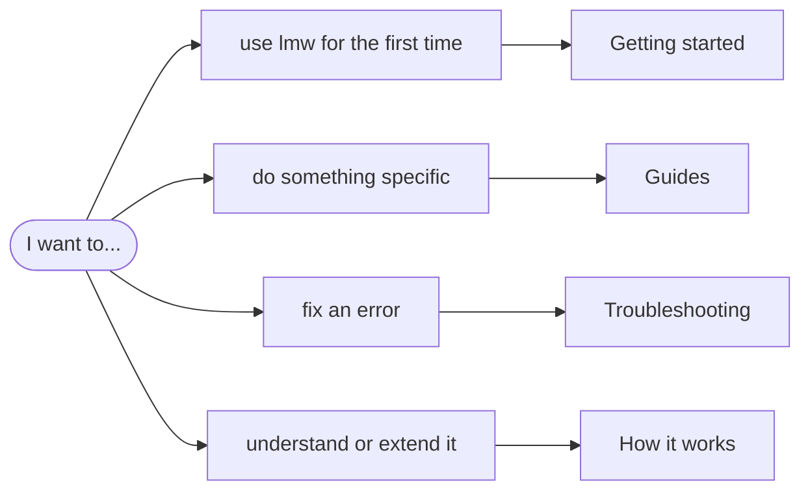

# lmw documentation

`lmw` (**L**inkedin**M**echa**W**arrior) is a command-line client for your own
LinkedIn account. This is the place to learn it, from the first command to
extending it with new features.

> [!TIP]
> New here? Read [Getting started](getting-started.md). It takes about ten
> minutes and ends with your feed in the terminal.

## Pick your path



### Learn

| Page | You will learn |
|---|---|
| [Getting started](getting-started.md) | Install `lmw`, connect your account, read your profile and feed. |
| [Glossary](glossary.md) | What words like *session cookie*, *HAR*, *cooldown* or *fingerprint* mean here. |

### Guides

Task-oriented pages. Each one starts with the short version, then explains.

| Guide | For when you want to... |
|---|---|
| [Connect your account](guides/import-session.md) | import your LinkedIn session, pick the best method for your browser, or switch accounts. |
| [Read LinkedIn](guides/read-linkedin.md) | see your profile and feed, get JSON, and combine `lmw` with other tools. |
| [Write and publish posts](guides/write-posts.md) | go from an idea to a published post safely. |
| [Stay safe](guides/stay-safe.md) | understand pacing, budgets and cooldowns, and know what to do if LinkedIn pushes back. |
| [Browser identity](guides/browser-identity.md) | control which browser `lmw` looks like. |
| [Extend lmw](guides/extend-lmw.md) | find out how LinkedIn's web app gets some data, and turn that into a new command. |

### Look things up

| Page | Contents |
|---|---|
| [Command reference](reference/lmw.md) | Every command and flag, generated from the code. |
| [Configuration](configuration.md) | Environment variables, files on disk, exit codes. |
| [Troubleshooting](troubleshooting.md) | Every error message, what it means and how to fix it. |
| [FAQ](faq.md) | Short answers to common questions. |
| [How it works](how-it-works.md) | Architecture and the life of a request, with diagrams. |

## The five commands you will use most

```bash
lmw auth import --har linkedin.har   # connect your account (once)
lmw me                               # who am I logged in as?
lmw feed -n 20                       # read the feed
lmw post publish --text-file post.txt  # publish a post (asks first)
lmw limits                           # how many requests have I made?
```

> [!WARNING]
> `lmw` uses LinkedIn's internal web API, which goes against LinkedIn's User
> Agreement. It is designed to stay light and human-paced, but using it can
> still get your account restricted. Read [Stay safe](guides/stay-safe.md)
> before relying on it.
