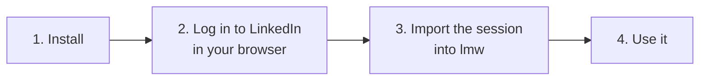
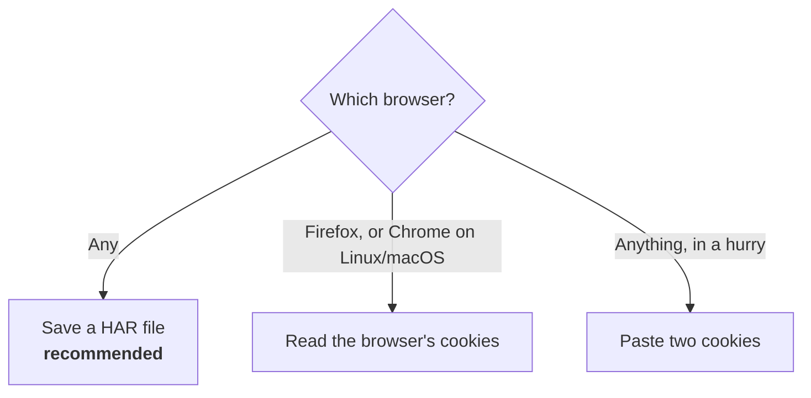

# Getting started

In about ten minutes you will install `lmw`, connect it to your LinkedIn
account and read your feed from the terminal.



**What you need**

- A computer with Linux or Windows (macOS works if you build from source).
- A browser where you can log in to LinkedIn (Chrome, Edge, Firefox, Brave...).
- A terminal. On Windows, PowerShell or Windows Terminal.

---

## Step 1. Install lmw

Go to the project's **Releases** page on GitHub and download one file:

| Your system | File |
|---|---|
| Linux (x86_64) | `lmw-linux` |
| Windows (x86_64) | `lmw.exe` |

That single file is the whole program. There is nothing else to install.

<details>
<summary><b>Linux: make it executable and put it on your PATH</b></summary>

```bash
chmod +x lmw-linux
mkdir -p ~/.local/bin
mv lmw-linux ~/.local/bin/lmw
```

Open a new terminal so that `~/.local/bin` is on your `PATH`.

</details>

<details>
<summary><b>Windows: put it somewhere and open a terminal there</b></summary>

1. Create a folder, for example `C:\Tools`, and move `lmw.exe` into it.
2. Optional: add `C:\Tools` to your `PATH` (Settings > System > About >
   Advanced system settings > Environment Variables) so that `lmw` works from
   any folder.
3. Open PowerShell in that folder. If it is not on your `PATH`, type `.\lmw`
   instead of `lmw` in the examples below.

Windows SmartScreen may warn about an unknown publisher the first time: choose
*More info > Run anyway*.

</details>

<details>
<summary><b>macOS, or building it yourself</b></summary>

With [Go](https://go.dev/dl/) installed:

```bash
go install github.com/MarcZX100/LinkedinMechaWarrior/cmd/lmw@latest
```

</details>

Check that it works:

```bash
lmw --version
```

```text
lmw 0.3.0
```

## Step 2. Log in to LinkedIn in your browser

Open LinkedIn in your usual browser and log in as you always do, including any
two-step verification.

> [!NOTE]
> **Why the browser?** `lmw` never types your password anywhere. It reuses the
> session your browser already has. For LinkedIn this is the most normal login
> possible: your browser, your network, your 2FA. It also means `lmw` never
> needs to know your password.

## Step 3. Import the session into lmw

There are three ways. The first one is the best; the other two are quicker.



### Option A: from a HAR file (recommended)

A HAR file is a recording of the requests your browser made. Importing one
gives `lmw` your session **and** your browser's exact identity, so its requests
look like they come from that same browser.

1. On LinkedIn, open the developer tools: <kbd>F12</kbd>, or
   <kbd>Ctrl</kbd>+<kbd>Shift</kbd>+<kbd>I</kbd> (<kbd>Cmd</kbd>+<kbd>Option</kbd>+<kbd>I</kbd> on macOS).
2. Click the **Network** tab.
3. Reload the page (<kbd>F5</kbd>) and wait until the feed appears.
4. Save the recording:
   - **Chrome / Edge / Brave:** right-click any request in the list >
     **Save all as HAR (with sensitive data)**.
   - **Firefox:** click the gear icon in the Network tab > **Save All As HAR**.
5. Import it:

```bash
lmw auth import --har linkedin.har
```

```text
Browser identity copied from the HAR file: Mozilla/5.0 (Windows NT 10.0; Win64; x64) ... Chrome/151.0.0.0 Safari/537.36
Logged in as Ada Lovelace.
Session from HAR file saved in the system keyring.
```

> [!CAUTION]
> The HAR file contains your session, which works like a password. **Delete it**
> once the import has worked.

> [!TIP]
> Chrome only offers *with sensitive data* in recent versions. If you only see
> a plain *Save all as HAR*, `lmw` will say the file has no session cookies:
> use option B or C for the session, and keep the HAR for the identity with
> `lmw identity import linkedin.har`.

### Option B: from the browser's cookie store

`lmw` can read the cookies directly from an installed browser. This works best
with **Firefox** on any system, and with Chrome-based browsers on Linux and
macOS. Close the browser first, because some browsers lock their cookie file
while they are open.

```bash
lmw auth import --browser            # search every installed browser
lmw auth import --browser firefox    # only Firefox
```

```text
Found LinkedIn sessions in: firefox (default), chrome. Using the most recent one.
Logged in as Ada Lovelace.
Session from firefox (default) saved in the system keyring.
```

> [!NOTE]
> Chrome on Windows encrypts its cookies in a way other programs cannot read.
> On Windows with Chrome or Edge, use option A or C.

### Option C: paste two cookies

1. On LinkedIn, open the developer tools.
2. Go to **Application** (Chrome / Edge) or **Storage** (Firefox) > **Cookies** >
   `https://www.linkedin.com`.
3. Run the command and paste the values it asks for:

```bash
lmw auth import
```

```text
Copy the cookies from your browser: DevTools > Application (Storage in Firefox) > Cookies > https://www.linkedin.com
li_at:
JSESSIONID: ajax:1234567890123456789
Logged in as Ada Lovelace.
Session from pasted cookies saved in the system keyring.
```

The `li_at` value is not shown while you type or paste it, so don't worry if
nothing appears; just press <kbd>Enter</kbd>.

### What just happened?

`lmw` checked the session with **one** request to LinkedIn, showed whose
account it is, and stored the session in your system's keyring (Windows
Credential Manager, macOS Keychain or the Linux Secret Service). If the check
fails, nothing is saved.

## Step 4. Use it

### Who am I?

```bash
lmw me
```

```text
Ada Lovelace
Mathematician · Writing the first program for the Analytical Engine
https://www.linkedin.com/in/ada-lovelace/
```

### Read your feed

```bash
lmw feed -n 3
```

```text
Grace Hopper · 2h
Rear Admiral · Computer scientist · Inventor of the first compiler

  The most dangerous phrase in the language is "we've always done it this way".

  This week our team replaced a nightly batch job with a 40-line script. Nobody had questioned the
  old process in six years.

  What process in your team deserves a second look?
  … (use --full to see everything)

1284 reactions · 96 comments · 41 reposts   https://www.linkedin.com/feed/update/urn:li:activity:7381234567890123456/

Katherine Johnson · 1d
Mathematician at NASA
(Alan Turing likes this)

  Checked the numbers by hand one more time. Launch is a go.

530 reactions · 12 comments · 3 reposts   https://www.linkedin.com/feed/update/urn:li:activity:7381234567890000002/
```

Long posts are cut after six lines; add `--full` to see them whole. Every post
ends with its link, so you can open it in the browser to react or comment.

### Notice the pauses

Commands that talk to LinkedIn are not instant: `lmw` waits a few random
seconds between requests, like a person would. Check what you have used:

```bash
lmw limits
```

```text
Requests in the last hour: 3/60
Requests in the last 24h:  3/300
No cooldown active
```

This is the core of how `lmw` keeps your account safe. It is worth reading
[Stay safe](guides/stay-safe.md) once.

## Where to go next

- **Write a post:** [Write and publish posts](guides/write-posts.md).
- **Use the output in scripts:** [Read LinkedIn](guides/read-linkedin.md), JSON section.
- **Something failed:** [Troubleshooting](troubleshooting.md) lists every error message.
- **Curious how it works:** [How it works](how-it-works.md).
- **All commands:** `lmw --help`, `lmw <command> --help`, or the [command reference](reference/lmw.md).
