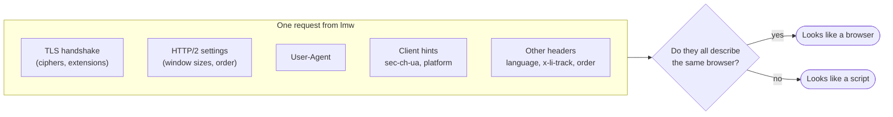

# Browser identity

> **Short version:** by default `lmw` looks like a current Chrome on your
> operating system. Import a HAR file from your own browser
> (`lmw identity import linkedin.har`) and it looks exactly like that browser.

## Why it matters

Every request says, in many small ways, which program sent it. A server can
compare all of them:



A typical script fails the first check: its TLS handshake is that of a
programming language, whatever its User-Agent claims. `lmw` makes every layer
agree:

- **TLS and HTTP/2** come from [tls-client](https://github.com/bogdanfinn/tls-client)
  browser profiles. Measured against a real Chromium, `lmw`'s JA4 and HTTP/2
  fingerprints are identical.
- **User-Agent and client hints** are built for the same browser and version.
  The `sec-ch-ua` header even reproduces the "GREASE" brand Chrome derives from
  its version number, which hand-written values usually get wrong.
- **LinkedIn's own headers** (`csrf-token`, `x-restli-protocol-version`,
  `x-li-lang`, `x-li-track`) match what its web app sends.

## See the current identity

```bash
lmw identity show
```

```text
Source:          default
Browser:         chrome 152 (TLS profile Chrome-152)
User-Agent:      Mozilla/5.0 (X11; Linux x86_64) AppleWebKit/537.36 (KHTML, like Gecko) Chrome/152.0.0.0 Safari/537.36
sec-ch-ua:       "Chromium";v="152", "Not?A_Brand";v="24", "Google Chrome";v="152"
Platform:        "Linux"
Accept-Language: en-US,en;q=0.9
```

## Use your own browser's identity

LinkedIn sees your session used by your browser and by `lmw`. The best disguise
is for both to be the same browser. Record a HAR on LinkedIn (see
[Connect your account](import-session.md#method-1-har-file)) and import it:

```bash
lmw identity import linkedin.har
```

```text
Identity copied: Mozilla/5.0 (Windows NT 10.0; Win64; x64) AppleWebKit/537.36 (KHTML, like Gecko) Chrome/151.0.0.0 Safari/537.36
```

`lmw auth import --har` does this automatically. From the most recent LinkedIn
API request in the file, it copies:

| Copied | Example |
|---|---|
| User-Agent | `... Chrome/151.0.0.0 Safari/537.36` |
| Client hints | `sec-ch-ua`, `sec-ch-ua-mobile`, `sec-ch-ua-platform` |
| Languages | `Accept-Language: es-ES,es;q=0.9,en;q=0.8` |
| LinkedIn headers | `x-li-lang`, `x-li-track` (web app version, time zone, screen) |
| Header order | the exact order your browser sends them in |

The identity contains no cookies; it is stored in `identity.json` in the
[state directory](../configuration.md#files-on-disk).

### Refresh it now and then

Browsers update every few weeks. After a major update your browser says
"Chrome 155" while `lmw` still says "Chrome 151". It is not dramatic, but
importing a fresh HAR every month or two keeps both in step.

## Which TLS profile is used

`lmw` picks the newest profile of your browser's family that is not newer than
your browser:

| Your browser | Family | Example |
|---|---|---|
| Chrome, Edge, Brave, Opera, Chromium | `chrome` | Chrome 151 → profile Chrome 150 |
| Firefox | `firefox` | Firefox 140 → profile Firefox 135 |
| Anything newer than the newest profile | same family | Chrome 160 → profile Chrome 152 |

Chrome-based browsers share Chrome's network stack, so they share its
fingerprint. Safari is not supported as an identity; `lmw` falls back to
Chrome for it.

## Go back to the default

```bash
lmw identity reset
```
