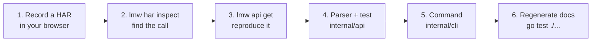

# Extend lmw

> **Short version:** record a HAR while LinkedIn's website shows the data you
> want, find the API call with `lmw har inspect`, reproduce it with
> `lmw api get`, then add a parser in `internal/api` and a command in
> `internal/cli`.

LinkedIn's internal API is undocumented, so every feature starts by watching
what LinkedIn's own website does. This guide walks through that loop. The
first half (finding the call) needs no programming; the second half is Go.



## 1. Record what the website does

1. Open LinkedIn in your browser and the developer tools, **Network** tab.
2. Clear the list, then go to the page that shows what you want (for example
   your notifications).
3. Save the requests as a HAR file (right-click the list).

## 2. Find the API call

```bash
lmw har inspect linkedin.har
```

```text
#12   GET  200 /voyager/api/feed/updatesV2?count=10&q=chronFeed&start=0
      included: SocialActivityCounts×10, SocialDetail×10, UpdateV2×10
#31   POST 200 /voyager/api/graphql?action=execute&queryId=voyagerMessagingDash...
...
42 API calls. Show one with --show INDEX.
```

Each line has the entry number, method, status, path, the query parameters
(already decoded), and the kinds of entities in the response. That last part
is usually the fastest way to spot the right call: notifications come back as
something like `...NotificationCard`, messages as `...Message`.

Narrow the list and look at one call in full:

```bash
lmw har inspect linkedin.har --filter graphql
lmw har inspect linkedin.har --show 31
```

`--show` prints the URL, the request body (for POST) and the response JSON.

> [!TIP]
> Many newer pages use `/voyager/api/graphql` with a `queryId` such as
> `voyagerMessagingDashMessengerConversations.4a3b...`. That hash changes when
> LinkedIn deploys a new version of the page, so commands built on GraphQL
> need the `queryId` refreshed now and then: keep it in one constant.

## 3. Reproduce it from lmw

Before writing code, check that the call works outside the browser:

```bash
lmw api get /feed/updatesV2 -p count=10 -p q=chronFeed -p start=0
```

- `-p KEY=VALUE` adds query parameters in order. Values keep the characters
  Rest.li needs as they are (`(`, `)`, `,`, `:`) and you can pass URNs already
  encoded, e.g. `-p "variables=(conversationUrn:urn%3Ali%3A...)"`.
- The request carries the session, CSRF token and identity headers, and goes
  through pacing and budgets like any command.
- `-v` shows the exact URL and response status.

If you get the data you saw in the HAR, the endpoint is usable.

## 4. Write the parser

Responses use LinkedIn's "normalized" JSON: the main object in `data`, every
entity in a flat `included` list, linked by URN through keys that start with
`*`. The `normalized` package handles that. Here is how `lmw me` is
implemented in `internal/api/api.go`:

```go
// Me returns your own profile.
func Me(ctx context.Context, c Client) (Profile, error) {
	raw, err := c.Get(ctx, "/me", nil)
	if err != nil {
		return Profile{}, err
	}
	return ParseMe(raw)
}

func ParseMe(raw []byte) (Profile, error) {
	doc := normalized.Parse(raw)
	mini := doc.Ref(doc.Data, "miniProfile") // follows data["*miniProfile"] into included
	...
	p := Profile{
		FirstName: normalized.String(mini["firstName"]),
		Headline:  normalized.String(mini["occupation"]),
		...
	}
```

The helpers you will use:

| Helper | Does |
|---|---|
| `normalized.Parse(raw)` | Decodes a response into `Data` and `Included`, indexed by URN |
| `doc.Ref(obj, "key")` | `obj["key"]` if inlined, else the entity referenced by `obj["*key"]` |
| `doc.Refs(obj, "key")` | The same, for lists |
| `doc.OfType("Suffix")` | Included entities whose `$type` ends with `Suffix` |
| `normalized.Text(v)` | Text from `"x"`, `{"text": "x"}` or `{"text": {"text": "x"}}` |
| `normalized.Dig(v, "a", "b")` | Nested lookup that never panics |

**Rules for parsers**

- **Never assume a field exists.** Shapes change; skip what you can't read
  instead of failing, and only return an error when nothing usable is left.
- **Put a test next to it** with a small response, cut down from the HAR and
  with personal data replaced. `internal/api/api_test.go` has examples.
- **Cap pagination.** Fetch pages of the size the website uses, with a hard
  maximum number of pages (see `Feed`).

## 5. Add the command

Commands live in `internal/cli`. This is `lmw me`:

```go
func (a *app) meCommand() *cobra.Command {
	return &cobra.Command{
		Use:   "me",
		Short: "Show your profile",
		Args:  exactArgs(0, "no arguments"),
		RunE: func(cmd *cobra.Command, _ []string) error {
			var profile api.Profile
			err := a.withClient(func(c *voyager.Client) (err error) {
				profile, err = api.Me(cmd.Context(), c)
				return err
			})
			if err != nil {
				return err
			}
			if a.jsonOut {
				return output.JSON(a.stdout, profile)
			}
			a.printf("%s\n", output.Profile(profile))
			return nil
		},
	}
}
```

`a.withClient` loads the session, builds the client with the right identity
and pacer, and saves any cookie LinkedIn refreshed. Register the new command
in `rootCommand()` (`internal/cli/root.go`) and add a test in
`internal/cli/cli_test.go`, where a fake LinkedIn answers by API path.

**Rules for commands**

- **Always go through `withClient`.** Never create your own HTTP client: it
  would skip pacing, budgets, cooldowns and the browser fingerprint.
- **Reading is GET.** Anything that changes something on LinkedIn (posting,
  reacting, messaging) must show what it will do and ask for confirmation, like
  `post publish`.
- **No bulk.** Don't add loops over many profiles, searches or contacts. Volume
  is the main thing that gets accounts restricted.
- **Support `--json`** for anything that shows data.

## 6. Regenerate the reference and run the tests

```bash
go test ./internal/cli -run TestReference -update   # rewrites docs/reference
go test ./...
```

`go test ./...` also checks that every `lmw ...` example in the documentation
uses commands and flags that exist, so update the guides if you rename
anything.

## Project layout

```text
cmd/lmw/           main()
internal/
  cli/             commands (cobra), tests with a fake LinkedIn, docs checks
  api/             endpoints and parsers          ← features go here
  normalized/      helpers for normalized JSON
  voyager/         HTTP client: fingerprint, headers, cookies, error handling
  pacing/          delays, budgets, cooldowns
  identity/        User-Agent, client hints, header order
  session/         session cookies in the keyring or a file
  auth/            session import from browser cookie stores
  har/             HAR reading
  postgen/         post outlines and validation
  output/          terminal formatting
  config/, errs/, version/
```

See [How it works](../how-it-works.md) for how the pieces fit together.
