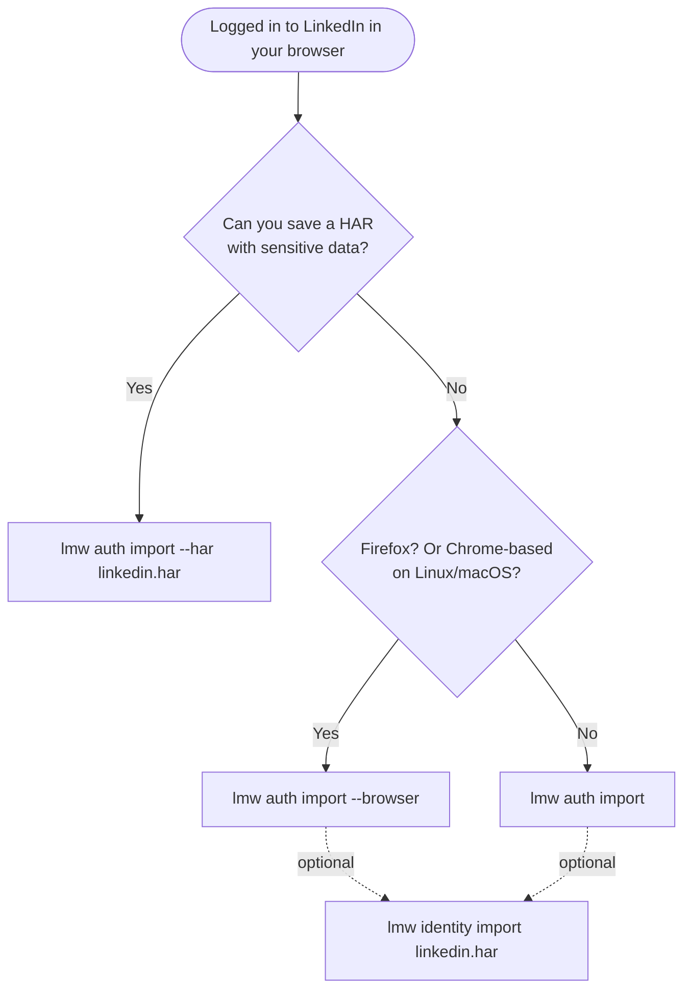
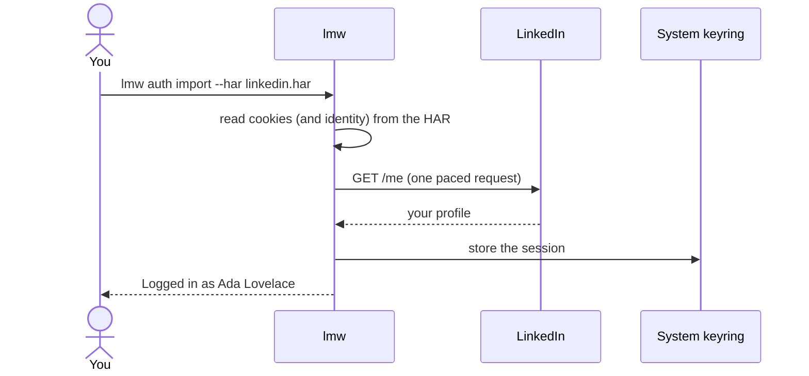

# Connect your account

> **Short version:** log in to LinkedIn in your browser, save a HAR file from
> the developer tools, run `lmw auth import --har linkedin.har`, delete the file.

`lmw` never logs in by itself. You log in with your normal browser and `lmw`
reuses that session. This page explains every way to do that, which one to
choose, and how to manage the session afterwards.

## Which method should I use?

| Method | Command | Session | Copies your browser's identity | Works with |
|---|---|:---:|:---:|---|
| **HAR file** (recommended) | `lmw auth import --har FILE` | ✅ | ✅ | Every browser |
| **Browser cookie store** | `lmw auth import --browser [NAME]` | ✅ | — | Firefox everywhere; Chrome-based browsers on Linux and macOS |
| **Paste cookies** | `lmw auth import` | ✅ | — | Every browser |



The identity matters because LinkedIn sees the same session used from two
places: your browser and `lmw`. When both look like the same browser, nothing
stands out. Without a HAR, `lmw` presents itself as a current desktop Chrome on
your operating system, which is a good default. See
[Browser identity](browser-identity.md).

## Method 1: HAR file

1. Log in to LinkedIn in your browser.
2. Open the developer tools (<kbd>F12</kbd>) and select the **Network** tab.
3. Reload the page and wait for the feed to load. You should see many requests,
   some of them to `/voyager/api/`.
4. Save the HAR:

   | Browser | How |
   |---|---|
   | Chrome, Edge, Brave, Opera | Right-click the request list > **Save all as HAR (with sensitive data)** |
   | Firefox | Gear icon (top right of the Network tab) > **Save All As HAR** |

5. Import it and then delete it:

```bash
lmw auth import --har linkedin.har
```

```text
Browser identity copied from the HAR file: Mozilla/5.0 (...) Chrome/151.0.0.0 Safari/537.36
Logged in as Ada Lovelace.
Session from HAR file saved in the system keyring.
```

> [!CAUTION]
> A HAR file "with sensitive data" contains your session cookie. Anyone with
> the file can use your account until the session ends. Delete it after the
> import, and never attach it to an issue or a chat.

**If `lmw` says the HAR has no session cookies,** your browser saved a
sanitized HAR. Look for the *with sensitive data* option, or import the
session with another method and keep the identity from the HAR:

```bash
lmw auth import --browser
lmw identity import linkedin.har
```

## Method 2: browser cookie store

`lmw` reads the cookie database of your installed browsers, finds the LinkedIn
session and uses the most recent one.

```bash
lmw auth import --browser              # every installed browser
lmw auth import --browser firefox      # only one browser
```

Browser names include `firefox`, `chrome`, `chromium`, `edge`, `brave`,
`opera` and `safari`.

```text
Found LinkedIn sessions in: firefox (default), chrome. Using the most recent one.
Logged in as Ada Lovelace.
Session from firefox (default) saved in the system keyring.
```

**Things to know**

- **Close the browser first.** Some browsers lock their cookie file while they
  run; `lmw` then finds nothing.
- **Chrome on Windows can't be read.** Since 2024 Chrome encrypts cookies on
  Windows with a key only Chrome itself can use. Use a HAR or paste the cookies.
- **Chrome-based browsers on Linux and macOS** keep the cookie key in the
  system keyring. Your desktop keyring must be unlocked; macOS may ask you to
  allow access to "Chrome Safe Storage".
- Only cookies that look valid are imported: expired cookies, cookies from
  other sites and values that could not be decrypted are skipped.

## Method 3: paste the cookies

1. Log in to LinkedIn in your browser and open the developer tools.
2. Go to **Application** (Chrome-based) or **Storage** (Firefox) > **Cookies** >
   `https://www.linkedin.com`.
3. Find two cookies: `li_at` (long, starts with `AQ`) and `JSESSIONID`
   (looks like `"ajax:1234567890123456789"`).
4. Run `lmw auth import` and paste each value when asked.

```bash
lmw auth import
```

The `li_at` value is not shown while you paste it. You can paste `JSESSIONID`
with or without its quotes; `lmw` adds them if they are missing, as LinkedIn
expects.

## What `auth import` does



- Only the cookies `lmw` needs are kept: `li_at`, `JSESSIONID` and a few
  browser and routing cookies (`bcookie`, `bscookie`, `li_gc`, `lang`, `liap`,
  `lidc`). Tracking cookies from other services are ignored.
- The session is verified with one request to `/me`. **If verification fails,
  nothing is saved.** Use `--no-verify` to skip the check (for example when
  you have hit your budget), at the risk of saving a session that doesn't work.
- Importing again replaces the stored session.

## Checking the session

```bash
lmw auth status
```

```text
Logged in as Ada Lovelace (https://www.linkedin.com/in/ada-lovelace/)
Session imported from HAR file on 2026-10-01 18:01.
```

It uses one request. Exit code 0 means the session works, 1 means it doesn't,
which makes it handy in scripts:

```bash
lmw auth status --json
```

## When the session ends

LinkedIn sessions usually last months, but they end when you log out in the
browser, change your password, or LinkedIn decides so. `lmw` notices it in two
ways:

- LinkedIn answers with "not logged in": you see *the LinkedIn session has expired*.
- LinkedIn deletes the session cookie in a response: you see *LinkedIn ended
  the session*, and `lmw` removes the stored session.

Either way the fix is the same: log in again in your browser and import again.
`lmw` never logs in on its own, because repeated logins from an unknown client
are a classic trigger for security checks.

## Logging out and switching accounts

```bash
lmw auth logout
```

It asks you to type `logout`, then removes the session from this computer.

> [!IMPORTANT]
> `auth logout` only forgets the session locally. The session itself stays
> valid on LinkedIn until you log out in the browser. If you think a session
> leaked, log out of LinkedIn in the browser (or use *Sign out of all
> sessions* in LinkedIn's settings).

`lmw` stores one session at a time. To switch accounts, log in to the other
account in your browser and import again; the new session replaces the old one.

## Where the session is stored

| Situation | Location |
|---|---|
| A system keyring is available (default) | Windows Credential Manager, macOS Keychain, or Secret Service on Linux, under the service `linkedin-mecha-warrior` |
| No keyring (e.g. a Linux server without a desktop) | `session.json` in the [state directory](../configuration.md#files-on-disk), readable only by you |

`lmw` falls back to the file automatically and warns you when it does. Force
one or the other with `LMW_SESSION_STORE=keyring` or `LMW_SESSION_STORE=file`.
