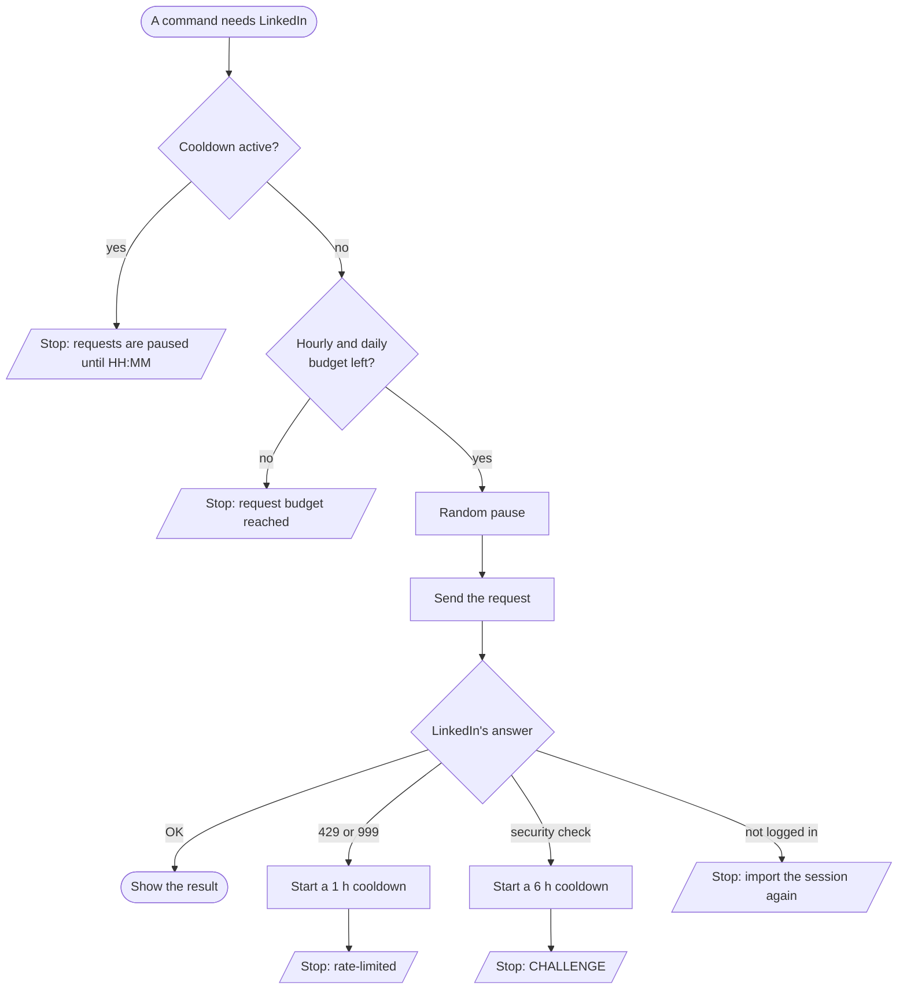

# Stay safe

> **Short version:** `lmw` paces itself, counts its requests and stops at the
> first sign of trouble. You don't need to do anything, except: use it lightly,
> from your usual network, and if LinkedIn asks for a security check, solve it
> in your browser before using `lmw` again.

`lmw` uses LinkedIn's internal web API, which LinkedIn doesn't allow. Accounts
get restricted mostly for **how much** and **how fast** they do things, and for
traffic that **doesn't look like a real browser**. `lmw` is designed around
those three points.

## The protections

| Protection | What it does | Default |
|---|---|---|
| **Random pauses** | Waits before each request, measured from the previous one, even across separate commands | 2-6 s, and 1 time in 10 an extra 6-18 s |
| **Hourly budget** | Refuses to send more than N requests in any 60 minutes | 60 |
| **Daily budget** | Refuses to send more than N requests in any 24 hours | 300 |
| **Cooldown after rate limiting** | LinkedIn answers HTTP 429 or 999: no requests at all for a while | 1 hour |
| **Cooldown after a challenge** | LinkedIn asks for a security check: no requests at all for a while | 6 hours |
| **No automatic login** | An ended session is reported, never "fixed" by logging in again | always |
| **Real browser fingerprint** | TLS, HTTP/2 and headers match a real browser | Chrome, or your browser via a HAR |
| **No bulk features** | No mass profile visits, search scraping, invitations or messages | by design |

## The life of a request



Every request counts towards the budgets, including failed ones, the check in
`auth import` and `auth status`. Commands that work offline (`post draft`,
`post preview`, `har inspect`, `identity`, `limits`) send nothing.

## Watching your usage

```bash
lmw limits
```

```text
Requests in the last hour: 7/60
Requests in the last 24h:  7/300
No cooldown active
```

The windows are rolling: a request made at 10:15 stops counting for the hourly
budget at 11:15.

## If LinkedIn pushes back

### "LinkedIn rate-limited the session"

```text
lmw: LinkedIn rate-limited the session: HTTP 999 (too many requests). Requests are paused for an hour
```

LinkedIn thinks there were too many requests. `lmw` pauses for an hour and
refuses to send anything until then:

```text
lmw: requests are paused until 19:01 because LinkedIn pushed back: HTTP 999 (too many requests). Check the account in your browser, then run `lmw limits --clear-cooldown` once you are sure it is fine
```

**What to do:** wait. Use LinkedIn in the browser normally for a while. If the
browser shows no warning, you can carry on after the cooldown, and consider
using `lmw` less intensively.

### "LinkedIn answered with a CHALLENGE"

```text
lmw: LinkedIn answered with a CHALLENGE. Requests are paused. Open LinkedIn in your browser, complete the security check, then run `lmw auth import` and `lmw limits --clear-cooldown`
```

LinkedIn wants to make sure a person is behind the account. This is the
important one. Follow these steps in order:

1. **Stop using `lmw`.** The 6-hour cooldown does this for you.
2. **Open LinkedIn in your browser** and complete whatever it asks: captcha,
   email code, phone or ID verification.
3. **Use LinkedIn normally in the browser** for a while.
4. **Import the session again,** because the check often renews it:
   `lmw auth import --har linkedin.har` (or your usual method). Add
   `--no-verify` if you want to avoid any request for now.
5. **Lift the cooldown** only when the account looks fine:
   `lmw limits --clear-cooldown`.
6. **Use `lmw` less** than before for the next few days.

> [!IMPORTANT]
> Don't clear a cooldown just to retry immediately. Repeated pushback in a
> short time is how temporary restrictions turn into longer ones.

## Good habits

- **Same network as your browser.** Avoid VPNs and servers in data centers;
  a session used from two very different places looks odd.
- **Import from a HAR** so that `lmw` presents itself as your actual browser.
  Refresh it when your browser updates (see [Browser identity](browser-identity.md)).
- **Few and irregular.** Reading your feed a few times a day is like a person.
  A script that runs every 10 minutes is not, whatever the budget says.
- **Prefer bigger, rarer reads:** one `lmw feed -n 30` is better than three
  `lmw feed` a minute apart.
- **Older, active accounts** get more leeway than brand-new ones.

## Changing the limits

The defaults are deliberately conservative. You can change them with
environment variables (see [Configuration](../configuration.md)):

```bash
LMW_REQUEST_MIN_DELAY=4 LMW_REQUEST_MAX_DELAY=10 lmw feed -n 30   # slower
```

`lmw` refuses unsafe values: pauses shorter than 1 second, a maximum below
the minimum, or an hourly budget larger than the daily one.

> [!CAUTION]
> Raising the budgets or shortening the pauses increases the risk. The
> protections are there because they match what triggers restrictions.

## What `lmw` will never do

- Log in with your password, or log in again behind your back.
- Visit profiles in bulk, scrape search results, or send invitations or
  messages in bulk.
- Publish anything without you typing `publish`.
- Keep sending requests after LinkedIn has pushed back.
