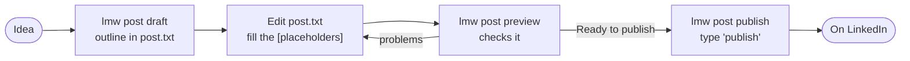

# Write and publish posts

> **Short version:** `lmw post draft "your idea" -o post.txt`, fill in the
> `[placeholders]`, check with `lmw post preview --text-file post.txt`, then
> `lmw post publish --text-file post.txt` and type `publish`.



`draft` and `preview` work offline. Only `publish` talks to LinkedIn, and only
after you confirm.

## 1. Start from an outline

```bash
lmw post draft "What I learned shipping a CLI in Go" --tone technical -o post.txt
```

```text
------------------------------------------------------------
A technical lesson worth sharing: What I learned shipping a CLI in Go.

[The context: what you were building or fixing, in one or two sentences.]

[The technical detail: the approach, the trade-off, or the result.]

How would you have approached it?
------------------------------------------------------------
249 characters
Replace the [placeholders] before publishing.
Saved to post.txt.
```

`lmw` doesn't invent content about your topic. It gives you a proven
structure: a hook with your idea, sections to fill in, and a question that
invites comments. You write the substance.

**Tones** change the hook, the sections and the closing question:

| `--tone` | Hook | Closing question |
|---|---|---|
| `professional` (default) | *Something I've been thinking about lately: ...* | *What has your experience been?* |
| `technical` | *A technical lesson worth sharing: ...* | *How would you have approached it?* |
| `casual` | *Quick one today: ...* | *Has anything similar happened to you?* |
| `founder` | *Building a company teaches you things nothing else does. This week: ...* | *Founders, what would you add?* |
| `educational` | *Here's a simple way to think about it: ...* | *What would you add to this?* |

**Lengths** set the number of sections: `short` (1), `medium` (2, default),
`long` (4).

The idea can be written without quotes, as several words:

```bash
lmw post draft My first year as a nurse --tone casual --length short
```

## 2. Write your post

Open `post.txt` in any editor and replace each `[placeholder]` with your own
text. Change anything you like: the outline is only a starting point. You can
also skip `draft` entirely and write the file from scratch.

## 3. Check it

```bash
lmw post preview --text-file post.txt
```

```text
------------------------------------------------------------
Shipping a CLI in Go taught me one thing: small tools win.

The whole client is a single 17 MB file that starts in 10 ms.

What is your favourite small tool?
------------------------------------------------------------
157 characters
Ready to publish.
```

`preview` refuses posts that:

- are empty;
- are longer than 3000 characters (LinkedIn's limit; counted as characters, so
  accents and emoji count as one);
- still contain a `[placeholder]` (text in square brackets of 3 or more
  characters, so something like `[0]` is fine).

Problems are listed and the command exits with code 1, so you can fix them
and run it again.

## 4. Publish

```bash
lmw post publish --text-file post.txt
```

```text
------------------------------------------------------------
Shipping a CLI in Go taught me one thing: small tools win.
...
------------------------------------------------------------
157 characters
Visible to: anyone
Type 'publish' to publish this post on LinkedIn: publish
Published: https://www.linkedin.com/feed/update/urn:li:activity:7381234567890000099/
```

- Nothing is sent unless you type exactly `publish`. Anything else cancels.
- `--connections-only` limits the post to your connections.
- For short posts you can use `--text "..."` instead of a file.

> [!WARNING]
> Publishing has not been verified against a live LinkedIn account yet. If it
> fails, nothing was published: LinkedIn rejects the whole request. To find
> out what changed, publish one post from the website while recording a HAR,
> then run `lmw har inspect linkedin.har --filter contentcreation`. See
> [Extend lmw](extend-lmw.md).

## Tips for posts that work

- **The first two lines matter most:** LinkedIn shows them before *...see more*.
- **Short paragraphs.** One idea each, with blank lines between them.
- **End with a real question** people can answer from experience.
- **Plain text.** LinkedIn doesn't render Markdown; `**bold**` shows as asterisks.
- **Hashtags are optional.** Two or three relevant ones at the end at most.
