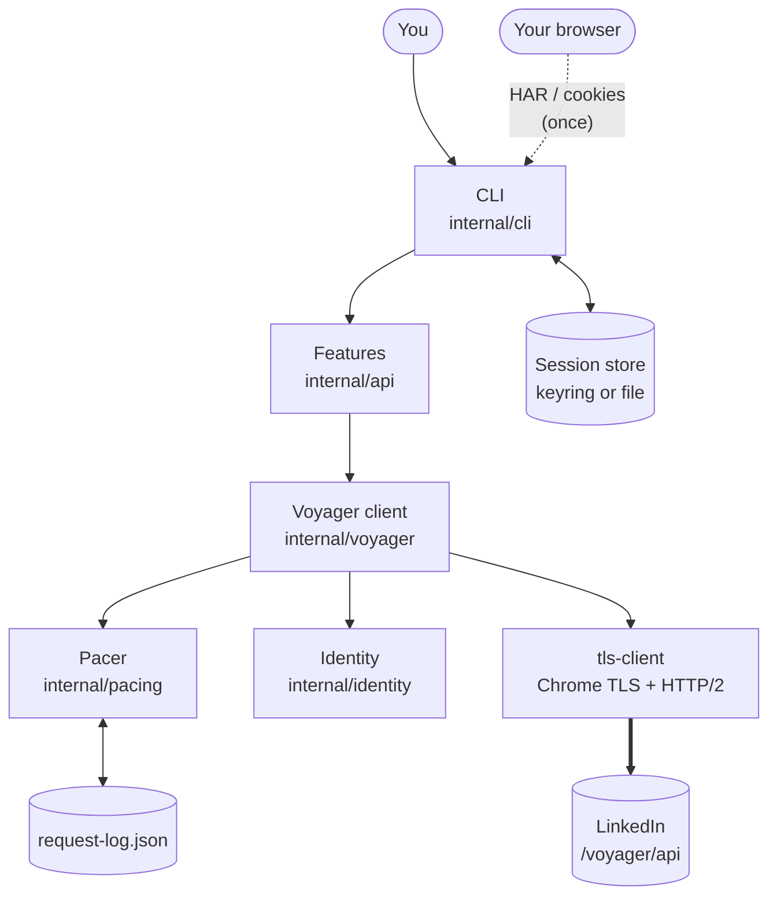
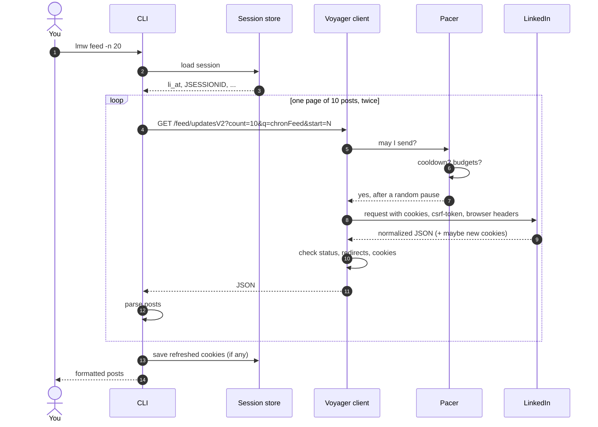
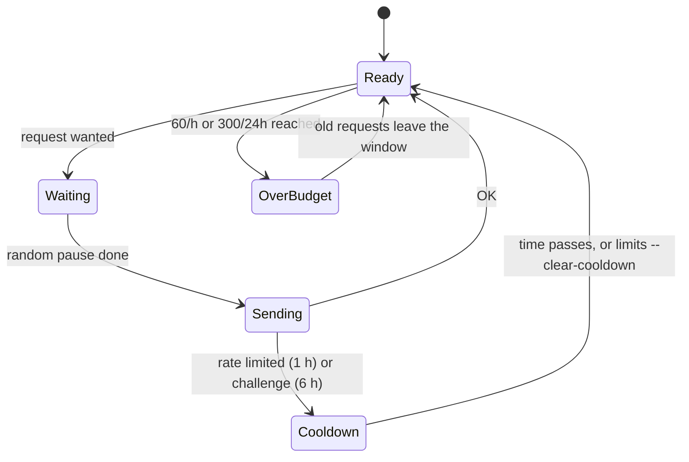

# How it works

A tour of `lmw`'s design: what happens when you run a command, and why each
piece exists.

## The big picture

| Piece | Job |
|---|---|
| **CLI** | Parses the command, loads the session and identity, prints results. |
| **Features** (`api`) | Knows which endpoint to call and how to read the answer. |
| **Voyager client** | Builds the request (URL, headers, cookies), sends it and interprets LinkedIn's answer, including every sign of trouble. |
| **Pacer** | Decides whether a request may be sent and when: pauses, budgets, cooldowns. |
| **Identity** | Which browser the requests claim to come from. |
| **tls-client** | Opens the connection with the same TLS and HTTP/2 fingerprint as that browser. |
| **Session store** | Keeps the session cookies in the system keyring, or a private file. |

## The life of `lmw feed`

## Looking like a browser

LinkedIn can compare several layers of every request. `lmw` keeps them
consistent:

1. **Connection.** [tls-client](https://github.com/bogdanfinn/tls-client)
   reproduces a browser's TLS handshake and HTTP/2 settings. Measured with a
   fingerprinting service, `lmw`'s JA4 (`t13d1517h2_8daaf6152771_...`) and
   HTTP/2 fingerprint are identical to a real Chromium's.
2. **Browser headers.** User-Agent, `sec-ch-ua` (built with Chrome's own
   algorithm for its fake "GREASE" brand), `sec-ch-ua-platform`,
   `sec-fetch-*`, `accept-language`, and `priority`, in a browser-like order.
3. **LinkedIn's headers.** `csrf-token` (the `JSESSIONID` without quotes),
   `x-restli-protocol-version: 2.0.0`, `x-li-lang`, and `x-li-track` when
   imported from a HAR, plus the `accept` header that asks for normalized JSON.
4. **Session.** The cookies come from your real browser session, and cookies
   LinkedIn refreshes are kept, as a browser would.

Importing a HAR replaces the defaults with your own browser's exact values,
including header order. See [Browser identity](guides/browser-identity.md).

## How LinkedIn's answers are interpreted

| LinkedIn answers | `lmw` concludes | Then |
|---|---|---|
| Redirect to `/checkpoint` or `/challenge` | Security check | 6-hour cooldown, stop |
| HTTP 403 mentioning a challenge | Security check | 6-hour cooldown, stop |
| HTTP 429 or 999 | Too many requests | 1-hour cooldown, stop |
| Redirect to `/login`, `/authwall`, `/uas/`, `/signup`, or HTTP 401 | Session expired | Stop, ask to import again |
| HTTP 403 mentioning CSRF | Session token mismatch | Stop, ask to import again |
| `Set-Cookie` deleting `li_at` | LinkedIn ended the session | Remove stored session, stop |
| Other `3xx`/`4xx`/`5xx` | Unexpected | Stop, show status and the start of the answer |
| `2xx` with HTML or invalid JSON | Unexpected page | Stop, show what came back |
| `2xx` with JSON | Success | Parse it |

`lmw` never retries automatically. A failed request is shown to you; repeating
it is your decision.

## Pacing in detail

- The pause is measured from the **previous request**, which is read from
  `request-log.json`, so separate commands run back to back are paced too.
- The pause is random between the minimum and maximum (2-6 s), and one time in
  ten it adds an extra 1-3× the maximum, like someone stopping to read.
- Requests are counted **before** they are sent, so failed requests count too.
- The log only keeps the last 24 hours.

## Sessions and storage

- `auth import` keeps only the cookies the website itself needs for API calls:
  `li_at` (the session), `JSESSIONID` (also the CSRF token), and `bcookie`,
  `bscookie`, `li_gc`, `lang`, `liap`, `lidc` (browser and routing cookies).
  Values are kept byte for byte, including the quotes LinkedIn uses.
- The session goes to the system keyring through
  [go-keyring](https://github.com/zalando/go-keyring), or to a `0600` file if no
  keyring is available.
- Cookie stores of installed browsers are read with
  [kooky](https://github.com/browserutils/kooky).

## Testing

`go test ./...` never contacts LinkedIn:

- **Fake transports** answer by API path, to test commands end to end:
  importing, reading, publishing, refreshed and deleted cookies, rate limits
  and cooldowns.
- **A local HTTPS server** checks the real tls-client stack: HTTP/2,
  compression and cookies.
- **A real Firefox cookie database** (fixture) checks importing from a browser.
- **Documentation checks** make sure the [command reference](reference/lmw.md)
  matches the code and that every `lmw ...` example in these pages uses
  commands and flags that exist.

## What it deliberately doesn't do

- No browser automation, and no logging in.
- No automatic retries after errors.
- No bulk operations.
- No telemetry: the only network traffic is to LinkedIn, for the command you run.
